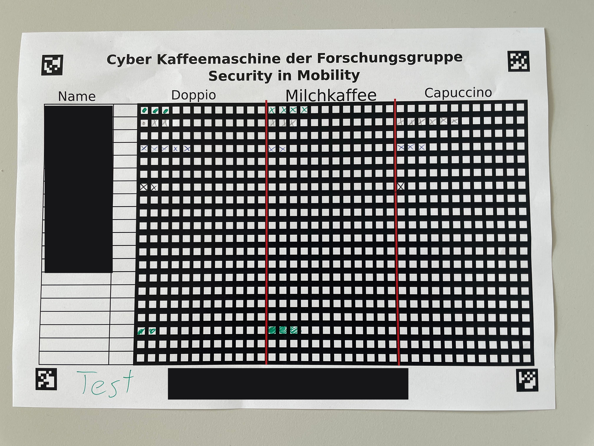

# Coffee Accounting

We have to keep track who drinks how much coffee to be able to split the
costs, as unfortunately the Technische Hochschule Ingolstadt does not pay
for our coffee.
The initial idea was to create a web app for tracking usage, but we feared
acceptance would be too low when requiring users to use their phone when
consuming coffee. Instead we decided for going with an easily scannable paper
based list.

## Example input

## Annotated output

